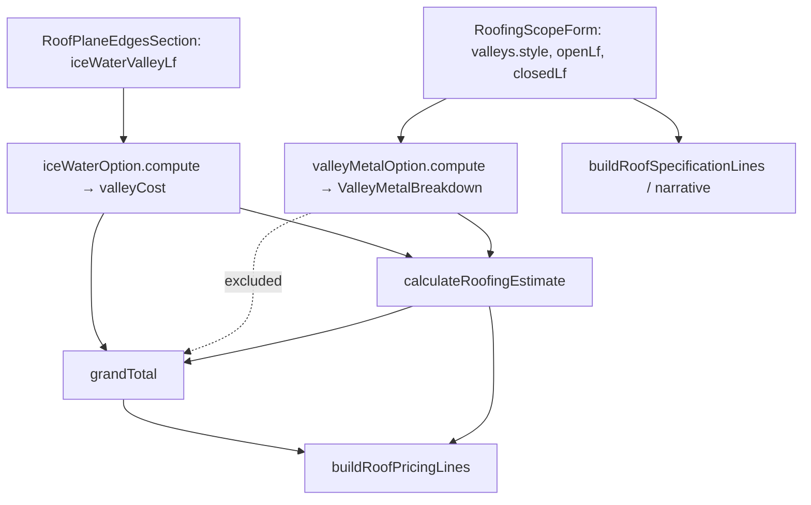

# Cursor Subagent Transcript - Run 0031

Source: cursor-subagent-17249b51-dac2-4e4a-ba34-48ca853bf505.raw.jsonl

## JSONL line 1 - user

<timestamp>Tuesday, Sep 1, 2026, 12:40 AM (UTC-5)</timestamp>
<user_query>
Explore the repository at d:\Downloads\Skill-Evaluation-Lab\ACTIVE\ShingleFile-main (a roofing estimation app). Be very thorough.

I need to understand the "open valley" / "valley metal" feature and how it flows into customer totals and the roofing proposal.

Find and report:
1. Every file/symbol mentioning valley (open valley, closed valley, valley metal, valleyMetal, valley_metal, valleyType, etc.) with file paths and line numbers.
2. Where the estimate calculation happens (the place that produces a "valley metal amount" shown in the estimate).
3. Where the "customer total" is computed — the aggregation of line items/charges into a total the customer pays.
4. Where the "roofing proposal" is generated (document/PDF/report) and what list of charges it iterates.
5. Any concept of "customer charge" vs non-customer charge (e.g. flags, categories, cost vs price, material vs labor) and how items get included/excluded from the customer total.

Report exact file paths, relevant code snippets with line numbers, and the data shapes involved. Do not make any edits.
</user_query>

## JSONL line 2 - assistant

Searching the repository for valley-related code and tracing estimate totals through the proposal flow.

[REDACTED]

Tool use: UpdateCurrentStep

```json
{
  "current_step": "Searching valley and totals code"
}
```

Tool use: Grep

```json
{
  "pattern": "valley",
  "path": "d:\\Downloads\\Skill-Evaluation-Lab\\ACTIVE\\ShingleFile-main",
  "-i": true
}
```

Tool use: Grep

```json
{
  "pattern": "valleyMetal|valley_metal|valleyType|open valley|closed valley",
  "path": "d:\\Downloads\\Skill-Evaluation-Lab\\ACTIVE\\ShingleFile-main",
  "-i": true
}
```

Tool use: Grep

```json
{
  "pattern": "customer total|customerTotal|CustomerTotal",
  "path": "d:\\Downloads\\Skill-Evaluation-Lab\\ACTIVE\\ShingleFile-main",
  "-i": true
}
```

Tool use: Grep

```json
{
  "pattern": "proposal|roofing proposal",
  "path": "d:\\Downloads\\Skill-Evaluation-Lab\\ACTIVE\\ShingleFile-main",
  "-i": true
}
```

## JSONL line 3 - assistant

[REDACTED]

Tool use: Glob

```json
{
  "glob_pattern": "**/*",
  "target_directory": "d:\\Downloads\\Skill-Evaluation-Lab\\ACTIVE\\ShingleFile-main"
}
```

Tool use: Grep

```json
{
  "-i": true,
  "path": "d:\\Downloads\\Skill-Evaluation-Lab\\ACTIVE\\ShingleFile-main",
  "pattern": "estimate",
  "head_limit": 50
}
```

Tool use: Grep

```json
{
  "-i": true,
  "path": "d:\\Downloads\\Skill-Evaluation-Lab\\ACTIVE\\ShingleFile-main",
  "pattern": "shingle|roof",
  "head_limit": 50
}
```

## JSONL line 4 - assistant

[REDACTED]

Tool use: Shell

```json
{
  "command": "Get-ChildItem -Path \"d:\\Downloads\\Skill-Evaluation-Lab\\ACTIVE\\ShingleFile-main\" -Recurse -File | Select-Object -First 50 FullName",
  "description": "List files in ShingleFile repo"
}
```

Tool use: Grep

```json
{
  "pattern": "valley",
  "-i": true
}
```

## JSONL line 5 - assistant

[REDACTED]

Tool use: Read

```json
{
  "path": "C:\\Users\\NeverAMoment\\.cursor\\projects\\d-Downloads-Skill-Evaluation-Lab-ACTIVE-ShingleFile-main\\terminals\\557724.txt",
  "limit": 30
}
```

Tool use: Glob

```json
{
  "glob_pattern": "**/*"
}
```

## JSONL line 6 - assistant

[REDACTED]

Tool use: Shell

```json
{
  "command": "Test-Path \"d:\\Downloads\\Skill-Evaluation-Lab\\ACTIVE\\ShingleFile-main\"; Get-ChildItem \"d:\\Downloads\\Skill-Evaluation-Lab\\ACTIVE\\ShingleFile-main\" -Force | Format-Table Name, Mode, Length",
  "description": "Check if repo path exists and list top level",
  "block_until_ms": 60000
}
```

## JSONL line 7 - assistant

[REDACTED]

Tool use: Shell

```json
{
  "block_until_ms": 120000,
  "command": "cd \"d:\\Downloads\\Skill-Evaluation-Lab\\ACTIVE\\ShingleFile-main\"; rg -i \"valley\" --line-number 2>$null; rg -i \"valleyMetal|valley_metal|valleyType|open.?valley|closed.?valley\" --line-number 2>$null",
  "description": "Ripgrep valley-related terms in repo"
}
```

Tool use: Shell

```json
{
  "block_until_ms": 120000,
  "command": "cd \"d:\\Downloads\\Skill-Evaluation-Lab\\ACTIVE\\ShingleFile-main\"; rg -i \"customerTotal|customer.?total|customerCharge|customer.?charge\" --line-number 2>$null; rg -i \"proposal\" --line-number 2>$null | Select-Object -First 80",
  "description": "Ripgrep customer total and proposal terms"
}
```

## JSONL line 8 - assistant

[REDACTED]

Tool use: Shell

```json
{
  "block_until_ms": 120000,
  "command": "cd \"d:\\Downloads\\Skill-Evaluation-Lab\\ACTIVE\\ShingleFile-main\"; rg -i \"grandTotal|grand.?total|billed|not billed|reference only|billable\" --line-number shared components pages composables 2>$null",
  "description": "Search billing and total aggregation terms"
}
```

Tool use: Read

```json
{
  "path": "d:\\Downloads\\Skill-Evaluation-Lab\\ACTIVE\\ShingleFile-main\\shared\\calculator\\calculateEstimate.ts"
}
```

Tool use: Read

```json
{
  "path": "d:\\Downloads\\Skill-Evaluation-Lab\\ACTIVE\\ShingleFile-main\\shared\\options\\valleyMetal.ts"
}
```

Tool use: Read

```json
{
  "path": "d:\\Downloads\\Skill-Evaluation-Lab\\ACTIVE\\ShingleFile-main\\shared\\contracts\\roofProposalPricing.ts"
}
```

## JSONL line 9 - assistant

[REDACTED]

Tool use: Read

```json
{
  "path": "d:\\Downloads\\Skill-Evaluation-Lab\\ACTIVE\\ShingleFile-main\\shared\\contracts\\roofProposalDocument.ts"
}
```

Tool use: Read

```json
{
  "path": "d:\\Downloads\\Skill-Evaluation-Lab\\ACTIVE\\ShingleFile-main\\shared\\contracts\\roofProposalScope.ts"
}
```

Tool use: Grep

```json
{
  "path": "d:\\Downloads\\Skill-Evaluation-Lab\\ACTIVE\\ShingleFile-main",
  "pattern": "calculateRoofingEstimate|valleyMetal"
}
```

Tool use: Read

```json
{
  "path": "d:\\Downloads\\Skill-Evaluation-Lab\\ACTIVE\\ShingleFile-main\\shared\\options\\materials.ts",
  "limit": 200
}
```

## JSONL line 10 - assistant

[REDACTED]

Tool use: Shell

```json
{
  "block_until_ms": 120000,
  "command": "cd \"d:\\Downloads\\Skill-Evaluation-Lab\\ACTIVE\\ShingleFile-main\"; rg -n \"valleyMetal|valleys\\.|ValleySelection|open-valley\" --glob \"*.{ts,vue,json}\"",
  "description": "Full valley symbol list with line numbers"
}
```

Tool use: Read

```json
{
  "offset": 380,
  "limit": 80,
  "path": "d:\\Downloads\\Skill-Evaluation-Lab\\ACTIVE\\ShingleFile-main\\shared\\types.ts"
}
```

Tool use: Read

```json
{
  "offset": 165,
  "limit": 35,
  "path": "d:\\Downloads\\Skill-Evaluation-Lab\\ACTIVE\\ShingleFile-main\\shared\\pricebook\\types.ts"
}
```

Tool use: Read

```json
{
  "path": "d:\\Downloads\\Skill-Evaluation-Lab\\ACTIVE\\ShingleFile-main\\shared\\pricebook\\data\\valleyMetalRates.json"
}
```

## JSONL line 11 - assistant

[REDACTED]

Tool use: Shell

```json
{
  "block_until_ms": 120000,
  "command": "cd \"d:\\Downloads\\Skill-Evaluation-Lab\\ACTIVE\\ShingleFile-main\"; rg -n \"valley\" shared\\options\\materials.ts pages docs composables server 2>$null; rg -n \"calculateRoofingEstimate|roofingTotals\" --glob \"*.{ts,vue}\"",
  "description": "Find estimate wiring and materials valley refs"
}
```

Tool use: Read

```json
{
  "path": "d:\\Downloads\\Skill-Evaluation-Lab\\ACTIVE\\ShingleFile-main\\shared\\options\\types.ts"
}
```

Tool use: Read

```json
{
  "limit": 120,
  "path": "d:\\Downloads\\Skill-Evaluation-Lab\\ACTIVE\\ShingleFile-main\\pages\\estimates\\[estimateId]\\index.vue"
}
```

Tool use: Read

```json
{
  "path": "d:\\Downloads\\Skill-Evaluation-Lab\\ACTIVE\\ShingleFile-main\\shared\\contracts\\proposalDocuments.ts",
  "limit": 100
}
```

## JSONL line 12 - assistant

[REDACTED]

Tool use: Read

```json
{
  "path": "d:\\Downloads\\Skill-Evaluation-Lab\\ACTIVE\\ShingleFile-main\\composables\\useEstimateTotals.ts"
}
```

Tool use: Read

```json
{
  "path": "d:\\Downloads\\Skill-Evaluation-Lab\\ACTIVE\\ShingleFile-main\\shared\\options\\iceWater.ts"
}
```

Tool use: Read

```json
{
  "limit": 100,
  "offset": 250,
  "path": "d:\\Downloads\\Skill-Evaluation-Lab\\ACTIVE\\ShingleFile-main\\shared\\types.ts"
}
```

Tool use: Read

```json
{
  "limit": 50,
  "offset": 70,
  "path": "d:\\Downloads\\Skill-Evaluation-Lab\\ACTIVE\\ShingleFile-main\\shared\\job.ts"
}
```

Tool use: Read

```json
{
  "limit": 80,
  "path": "d:\\Downloads\\Skill-Evaluation-Lab\\ACTIVE\\ShingleFile-main\\shared\\contracts\\roofProposalNarrative.ts",
  "offset": 250
}
```

Tool use: Read

```json
{
  "path": "d:\\Downloads\\Skill-Evaluation-Lab\\ACTIVE\\ShingleFile-main\\server\\api\\jobs\\[jobId]\\contracts.get.ts"
}
```

## JSONL line 13 - assistant

[REDACTED]

Tool use: Read

```json
{
  "limit": 60,
  "path": "d:\\Downloads\\Skill-Evaluation-Lab\\ACTIVE\\ShingleFile-main\\shared\\options\\index.ts"
}
```

Tool use: Read

```json
{
  "limit": 50,
  "offset": 395,
  "path": "d:\\Downloads\\Skill-Evaluation-Lab\\ACTIVE\\ShingleFile-main\\components\\RoofingScopeForm.vue"
}
```

Tool use: Read

```json
{
  "path": "d:\\Downloads\\Skill-Evaluation-Lab\\ACTIVE\\ShingleFile-main\\components\\EstimateSummaryCard.vue"
}
```

Tool use: Read

```json
{
  "limit": 50,
  "offset": 125,
  "path": "d:\\Downloads\\Skill-Evaluation-Lab\\ACTIVE\\ShingleFile-main\\shared\\roofLineMeasurements.ts"
}
```

Tool use: Read

```json
{
  "limit": 30,
  "offset": 100,
  "path": "d:\\Downloads\\Skill-Evaluation-Lab\\ACTIVE\\ShingleFile-main\\shared\\roofArea.ts"
}
```

Tool use: Read

```json
{
  "limit": 30,
  "offset": 330,
  "path": "d:\\Downloads\\Skill-Evaluation-Lab\\ACTIVE\\ShingleFile-main\\shared\\types.ts"
}
```

## JSONL line 14 - assistant

[REDACTED]

Tool use: Shell

```json
{
  "block_until_ms": 120000,
  "command": "cd \"d:\\Downloads\\Skill-Evaluation-Lab\\ACTIVE\\ShingleFile-main\"; rg -n \"valleysFt|Valley style|Open valley|valley metal\" --glob \"*.{ts,vue,json,md}\"",
  "description": "Search remaining valley-related symbols"
}
```

Tool use: Read

```json
{
  "limit": 80,
  "path": "d:\\Downloads\\Skill-Evaluation-Lab\\ACTIVE\\ShingleFile-main\\pages\\estimates\\[estimateId]\\contracts\\[contractKind].vue"
}
```

Tool use: Read

```json
{
  "limit": 50,
  "offset": 470,
  "path": "d:\\Downloads\\Skill-Evaluation-Lab\\ACTIVE\\ShingleFile-main\\pages\\estimates\\[estimateId]\\index.vue"
}
```

Tool use: Read

```json
{
  "limit": 30,
  "offset": 505,
  "path": "d:\\Downloads\\Skill-Evaluation-Lab\\ACTIVE\\ShingleFile-main\\shared\\types.ts"
}
```

## JSONL line 15 - assistant

[REDACTED]

Tool use: Grep

```json
{
  "path": "d:\\Downloads\\Skill-Evaluation-Lab\\ACTIVE\\ShingleFile-main",
  "pattern": "roofProposalNarrative|buildRoofNarrative"
}
```

Tool use: Read

```json
{
  "limit": 80,
  "offset": 170,
  "path": "d:\\Downloads\\Skill-Evaluation-Lab\\ACTIVE\\ShingleFile-main\\shared\\contracts\\proposalDocuments.ts"
}
```

Tool use: Read

```json
{
  "limit": 40,
  "path": "d:\\Downloads\\Skill-Evaluation-Lab\\ACTIVE\\ShingleFile-main\\pages\\calculator\\index.vue"
}
```

Tool use: Read

```json
{
  "limit": 30,
  "offset": 200,
  "path": "d:\\Downloads\\Skill-Evaluation-Lab\\ACTIVE\\ShingleFile-main\\shared\\pricebook\\schemas.ts"
}
```

## JSONL line 16 - assistant

[REDACTED]

Tool use: Shell

```json
{
  "command": "cd \"d:\\Downloads\\Skill-Evaluation-Lab\\ACTIVE\\ShingleFile-main\"; rg -n \"roofProposalNarrative|buildRoofNarrative\"",
  "description": "Find narrative module usage"
}
```

Tool use: Read

```json
{
  "limit": 50,
  "path": "d:\\Downloads\\Skill-Evaluation-Lab\\ACTIVE\\ShingleFile-main\\shared\\options\\install.ts"
}
```

## JSONL line 17 - assistant

[REDACTED]

Tool use: Read

```json
{
  "path": "d:\\Downloads\\Skill-Evaluation-Lab\\ACTIVE\\ShingleFile-main\\shared\\contracts\\modules\\compose.ts"
}
```

Tool use: Read

```json
{
  "limit": 35,
  "path": "d:\\Downloads\\Skill-Evaluation-Lab\\ACTIVE\\ShingleFile-main\\shared\\contracts\\roofProposalNarrative.ts"
}
```

Tool use: Read

```json
{
  "limit": 25,
  "path": "d:\\Downloads\\Skill-Evaluation-Lab\\ACTIVE\\ShingleFile-main\\shared\\pricebook\\data\\iceWaterRates.json"
}
```

Tool use: Read

```json
{
  "path": "d:\\Downloads\\Skill-Evaluation-Lab\\ACTIVE\\ShingleFile-main\\shared\\pricebook\\data\\iceWaterOptions.json"
}
```

## JSONL line 18 - assistant

[REDACTED]

Tool use: Shell

```json
{
  "block_until_ms": 120000,
  "command": "cd \"d:\\Downloads\\Skill-Evaluation-Lab\\ACTIVE\\ShingleFile-main\"; rg -i \"valley\" --line-number --sort path",
  "description": "Complete valley mention inventory sorted by path"
}
```

## JSONL line 19 - assistant

[REDACTED]

Tool use: Shell

```json
{
  "command": "cd \"d:\\Downloads\\Skill-Evaluation-Lab\\ACTIVE\\ShingleFile-main\"; rg -n \"composeTradeContract|buildRoofProposal\" server pages",
  "description": "Find which proposal builders are used in API/UI"
}
```

## JSONL line 20 - assistant

[REDACTED]

Tool use: Glob

```json
{
  "glob_pattern": "**/contracts*.ts",
  "target_directory": "d:\\Downloads\\Skill-Evaluation-Lab\\ACTIVE\\ShingleFile-main\\server"
}
```

Tool use: Read

```json
{
  "limit": 140,
  "path": "d:\\Downloads\\Skill-Evaluation-Lab\\ACTIVE\\ShingleFile-main\\server\\utils\\jobContractStore.ts"
}
```

## JSONL line 21 - assistant

[REDACTED]

Tool use: UpdateCurrentStep

```json
{
  "final_summary": "Open-valley **valley metal** is computed in `shared/options/valleyMetal.ts` and shown in the estimate UI, but **`grandTotal` explicitly excludes it** (`shared/calculator/calculateEstimate.ts`). Customer price still includes **closed-valley ice & water** via per-plane `iceWaterValleyLf`. The roof proposal’s **Scope Summary** uses `buildRoofPricingLines` (no valley-metal line); **Specifications** describe valleys from `RoofingScope.valleys`. Billing vs reference-only is mainly the option module **`billed`** flag plus materials take-off outside `grandTotal`.",
  "completed_subtitle": "Mapped valley flow and totals"
}
```

## JSONL line 22 - assistant

# Open valley / valley metal — codebase report

ShingleFile splits **two valley concepts**:

| Concept | Storage | Affects customer $ |
|--------|---------|-------------------|
| **Job-level valley style / LF** | `RoofingScope.valleys` (`ValleySelection`) | **Valley metal** reference only (`billed: false`) |
| **Per-plane I&W valley LF** | `RoofArea.iceWaterValleyLf` | **Ice & water** (`billed: true` when option covers valleys) |

---

## 1. Every file mentioning valley (paths + line numbers)

Absolute base: `d:\Downloads\Skill-Evaluation-Lab\ACTIVE\ShingleFile-main\`

### Core domain & calculation
| File | Lines (valley-related) |
|------|------------------------|
| `shared\types.ts` | 290, 336–350, 357, 402, 407–414, 519, 548 |
| `shared\job.ts` | 85 |
| `shared\roofArea.ts` | 22, 111 |
| `shared\calculator\calculateEstimate.ts` | 23, 50, 131, 134, 170 |
| `shared\options\valleyMetal.ts` | 2, 10–11, 14–17, 24–29, 32–33, 36–58 |
| `shared\options\iceWater.ts` | 5–10, 31–32, 40, 43, 49, 76, 80, 86–87, 94, 97, 99, 107, 111–114, 117, 120, 125, 127, 131, 138 |
| `shared\options\materials.ts` | 66, 69, 148 |
| `shared\options\index.ts` | 31, 56 |

### Pricebook
| File | Lines |
|------|-------|
| `shared\pricebook\types.ts` | 52, 168, 178–182, 208, 214, 220, 317 |
| `shared\pricebook\schemas.ts` | 208–213, 236 |
| `shared\pricebook\index.ts` | 29, 64, 112–113, 141 |
| `shared\pricebook\data\valleyMetalRates.json` | 3 (`open-valley`) |
| `shared\pricebook\data\iceWaterRates.json` | 7 (`valley`) |
| `shared\pricebook\data\iceWaterOptions.json` | 5, 9, 11, 15, 17, 23, 29 |
| `shared\pricebook\data\lowSlopeOptions.json` | 11, 15 (“Dead Valley” product keys) |

### Contracts / proposals
| File | Lines |
|------|-------|
| `shared\contracts\roofProposalScope.ts` | 102–112, 146 |
| `shared\contracts\roofProposalNarrative.ts` | 25–26, 262–271 |
| `shared\contracts\modules\compose.ts` | 19, 179 (narrative specs) |

### UI
| File | Lines |
|------|-------|
| `components\RoofingScopeForm.vue` | 70, 405–427 |
| `components\roof\RoofPlaneEdgesSection.vue` | 26–27 |
| `components\roof\RoofJobTotalsSection.vue` | 13 |
| `components\roof\RoofMeasurementWorkspaceSection.vue` | 36 |
| `components\roof\RoofPlaneSizeSection.vue` | 25, 85 |
| `components\roof\RoofQuickLinearCalculator.vue` | 21, 31 |
| `components\roof\RoofWasteFactorControl.vue` | 27 |
| `pages\catalog\index.vue` | 45 |

### Measurement / AI
| File | Lines |
|------|-------|
| `shared\roofLineMeasurements.ts` | 7, 133–134 |
| `server\utils\grokRoofLines.ts` | 7 |

**Symbols:** `ValleySelection`, `valleys`, `openLf`, `closedLf`, `style: "open" \| "closed"`, `valleyMetal`, `valleyMetalRates`, `ValleyMetalRate`, `ValleyMetalBreakdown`, `open-valley`, `iceWaterValleyLf`, `coversValleys`, `valleyCost`, `valleysFt` (measurement overrides only). There is no `valleyType` or `valley_metal` identifier in code.

---

## 2. Where “valley metal amount” is calculated

**Orchestrator:** `d:\Downloads\Skill-Evaluation-Lab\ACTIVE\ShingleFile-main\shared\calculator\calculateEstimate.ts`

```131:151:d:\Downloads\Skill-Evaluation-Lab\ACTIVE\ShingleFile-main\shared\calculator\calculateEstimate.ts
  const valleyMetal = valleyMetalOption.compute(jobCtx);
  const materials = materialsCounts(roofing, catalog);

  // valleyMetal is intentionally excluded — it is not billed.
  const grandTotal =
    areaCosts.reduce((sum, area) => sum + area.total, 0) +
    ridge.total +
    // ... job-level billed options ...
    permit +
    extras.amount;
```

**Math & metadata:** `shared\options\valleyMetal.ts`

```14:34:d:\Downloads\Skill-Evaluation-Lab\ACTIVE\ShingleFile-main\shared\options\valleyMetal.ts
export type ValleyMetalBreakdown = {
  pricePerFoot: Money;
  billableLf: number;
  cost: Money;
};

function valleyMetalCost(
  valleys: ValleySelection,
  cat: Catalog,
): ValleyMetalBreakdown {
  const row = (cat.valleyMetalRates as ValleyMetalRate[]).find(
    (r) => r.key === "open-valley",
  );
  const pricePerFoot = row?.pricePerFoot ?? 0;
  const billableLf = valleys.style === "open" ? valleys.openLf : 0;
  return { pricePerFoot, billableLf, cost: billableLf * pricePerFoot };
}
```

**Input shape** (`shared\types.ts`):

```407:415:d:\Downloads\Skill-Evaluation-Lab\ACTIVE\ShingleFile-main\shared\types.ts
export type ValleySelection = {
  style: "open" | "closed";
  openLf: number;
  closedLf: number;
};
```

**Catalog rate** (`shared\pricebook\data\valleyMetalRates.json`): `{ "key": "open-valley", "pricePerFoot": 1.5 }`.

**UI display:** `components\RoofingScopeForm.vue` lines 405–427 — shows `totals.valleyMetal.billableLf`, `pricePerFoot`, `cost` with “(not billed)”.

**Wiring:** `composables\useEstimateTotals.ts` calls `calculateRoofingEstimate` whenever the job draft changes.

**Note:** Comments say valley metal “informs materials counts,” but `materialsCounts()` in `shared\options\materials.ts` does **not** use `roofing.valleys` or `valleyMetal`; it only uses `iceWaterValleyLf` for I&W square footage (line 148). Valley metal is reference-only in practice today.

---

## 3. Where the customer total is computed

There is no separate `customerTotal` symbol; the customer-facing number is **`RoofingEstimateTotals.grandTotal`**.

**Single source of truth:** `calculateRoofingEstimate()` in `shared\calculator\calculateEstimate.ts`.

**Per-area subtotal** (each plane):

```91:97:d:\Downloads\Skill-Evaluation-Lab\ACTIVE\ShingleFile-main\shared\calculator\calculateEstimate.ts
    return {
      install,
      drip,
      under,
      ice,
      total: install.total + drip.total + under.cost + ice.total,
    };
```

**Grand total** = sum of all `areaCosts[].total` plus job-level options that are included in the sum (ridge, warranty, step flashing, chimney, chimney kit, accessories, satellite, antenna, lightning, skylights, no access, gutter removal, low slope) **plus** `job.permit` and `job.extras.amount`. **`valleyMetal.cost` is not in that sum.**

**Consumers:**
- `composables\useEstimateTotals.ts` → estimate editor
- `components\EstimateSummaryCard.vue` → displays `totals.grandTotal`
- `pages\estimates\[estimateId]\index.vue` → “Grand total” section
- `server\api\jobs\[jobId]\contracts.get.ts` and `server\utils\jobContractStore.ts` → contract amounts

**Return type** (`RoofingEstimateTotals`): includes both `grandTotal` and informational `valleyMetal` / `materials` alongside all option breakdowns.

---

## 4. Roofing proposal generation & charge list

### Path A — contract preview API (what `/estimates/.../contracts` uses)

1. `server\api\jobs\[jobId]\contracts.get.ts` → `calculateRoofingEstimate` → `buildProposalDocuments()`
2. `shared\contracts\proposalDocuments.ts` → `buildRoofProposal()`
3. `shared\contracts\roofProposalDocument.ts` builds sections; pricing uses **`buildRoofPricingLines()`**

**Pricing lines iterated** (`shared\contracts\roofProposalPricing.ts`):

- Each roof area with `areaCost.total > 0` (aggregated install + drip + underlayment + ice & water)
- Ridge vent (if `ridge.total > 0`)
- Warranty, step flashing, chimney removal, chimney kit
- Each accessory line, satellite, antenna, lightning rods
- Each skylight line, no-access surcharge, gutter removal, low-slope
- Building permit (`job.permit`)
- Extras (`job.extras`)

**Valley metal is not a pricing line.** Open-valley dollars never appear in `buildRoofPricingLines`.

**Specifications (non-dollar)** — `buildRoofSpecificationLines()` in `roofProposalScope.ts` includes a **Valleys** spec from job-level `roofing.valleys` (open vs “Half lace valley”), not a dollar amount:

```102:112:d:\Downloads\Skill-Evaluation-Lab\ACTIVE\ShingleFile-main\shared\contracts\roofProposalScope.ts
  const valleyLf =
    roofing.valleys.style === "open"
      ? roofing.valleys.openLf
      : roofing.valleys.closedLf;
  const valleyLine =
    valleyLf > 0
      ? line(
          "Valleys",
          `${valleyLf} LF — ${roofing.valleys.style === "open" ? "Open valley" : "Half lace valley"}`,
        )
      : line("Valleys", "None on this roof");
```

**Contract total fields:** `roofProposalDocument.ts` sets Agreement amount, document `total`, and cancellation section to `roofingTotals.grandTotal`.

**Materials (not customer total):** `buildRoofOrderForm()` in `proposalDocuments.ts` lists shingle bundles, cap, starter, I&W squares, felt, drip sticks, plywood from `roofingTotals.materials` — no valley metal SKU/count.

### Path B — modular composed contracts (saved/regenerated)

`server\utils\jobContractStore.ts` → `composeTradeContract()` in `shared\contracts\modules\compose.ts`:

- **`agreement-amount`** module: lump sum = `roofingTotals.grandTotal` (not line-by-line pricing)
- **`roof-specifications`** module: `buildRoofProcessNarrativeLines()` from `roofProposalNarrative.ts` (prose including open metal vs half-lace valleys, lines 262–271)

Preview UI still primarily uses Path A via `contracts.get.ts`.

---

## 5. Customer charge vs non-customer charge

### Primary mechanism: `billed` on option modules

Defined in `shared\options\types.ts` (lines 60–61): **`billed: true`** means the option’s cost is part of the customer grand total.

**Valley metal:** `billed: false` in `shared\options\valleyMetal.ts` (line 42).

**Registry:** `shared\options\index.ts` — `areaOptions` + `jobOptions`; `/pages/calculator/index.vue` shows “Billed” vs “Not billed” from `spec.billed`.

**Enforcement:** Only `calculateRoofingEstimate` decides what enters `grandTotal`; the `billed` flag is documentation + calculator reference unless mirrored manually in the sum (valley metal is explicitly excluded in code even though it has `billed: false`).

### Categories in practice

| Category | Included in `grandTotal`? | Examples |
|----------|---------------------------|----------|
| Per-area install / drip / underlayment / ice & water | Yes (via `areaCosts[].total`) | `installOption`, `dripEdgeOption`, `underlaymentOption`, `iceWaterOption` (`billed: true`) |
| Job-level add-ons | Yes, if computed cost > 0 | ridge, warranty, accessories, etc. |
| Permit & extras | Yes | `job.permit`, `job.extras.amount` |
| Valley metal (open LF × rate) | **No** | `totals.valleyMetal` returned but not summed |
| Materials take-off | **No** | `totals.materials`; UI note on estimate page: “not part of the customer total” |

### Valley-related **customer** charges (not valley metal)

**Closed-valley ice & water** uses **`iceWaterValleyLf`** per plane and catalog `iceWaterRates` key `"valley"` ($1.50/ft in JSON), when the area’s `iceWaterOption` has `coversValleys: true` (“Valleys Only”, “Valleys & Eaves”). That flows into `areaCosts[].ice.total` and thus **`grandTotal`**.

Job-level **`closedLf`** on `ValleySelection` is for tracking / proposal spec when style is closed; it is **not** multiplied by the valley-metal rate. I&W valley billing uses **`iceWaterValleyLf`**, which can differ per plane.

### Cost vs price

The codebase uses **`Money`** and “cost” field names on breakdown objects interchangeably for **customer price components** (e.g. `valleyMetal.cost`, `warranty.cost`). There is no separate internal cost vs retail margin layer for valley metal.

### Labor vs material

Install combines labor rates and shingle material in one per-area `install.total`; valley metal is neither labor nor a rolled-up install line—it is a separate non-billed job option.

---

## End-to-end flow (valley metal vs customer total vs proposal)



**Takeaway:** Open-valley **metal dollars** are calculated and shown on the estimate for reference only; the **contract price** and **Scope Summary** lines omit them. Valleys still appear in **Specifications** as LF + style, and **closed-valley I&W** can add real dollars through per-plane `iceWaterValleyLf` inside each roof area’s bundled pricing line.

[REDACTED]

## JSONL line 23 - turn_ended

```json
{
  "type": "turn_ended",
  "status": "success"
}
```
