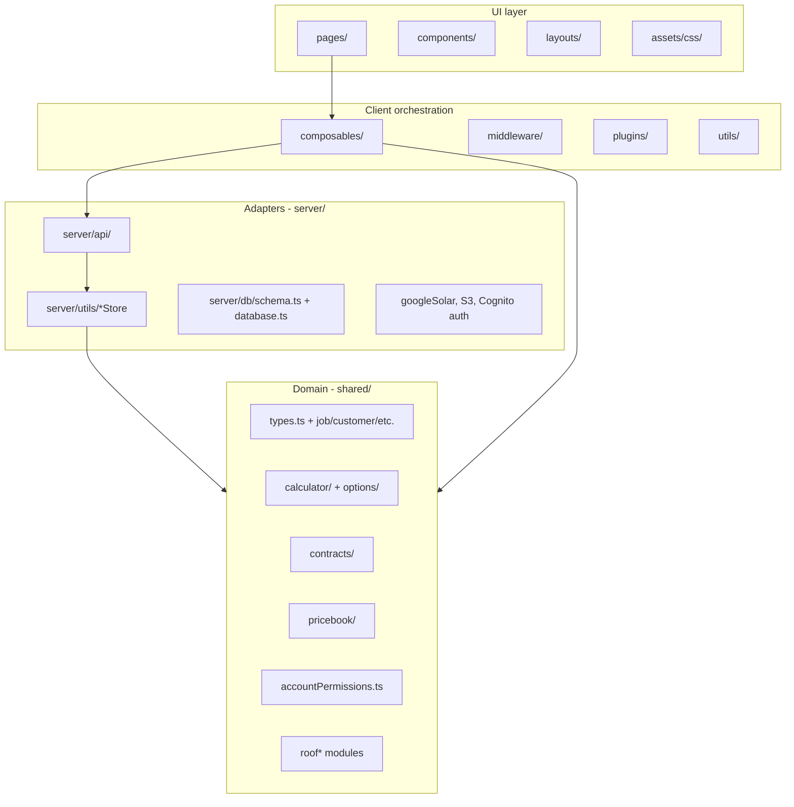

# Cursor Subagent Transcript - Run 0031

Source: cursor-subagent-57d86e3f-2e27-4280-a360-c011f54e6852.raw.jsonl

## JSONL line 1 - user

<timestamp>Tuesday, Sep 1, 2026, 12:40 AM (UTC-5)</timestamp>
<user_query>
Explore the repository at d:\Downloads\Skill-Evaluation-Lab\ACTIVE\ShingleFile-main. Thoroughness: medium.

Report:
1. Top-level structure, tech stack, framework, language(s), build tooling, package.json / config files.
2. The overall architecture layering: where UI lives, where business/domain logic lives, where adapters (network, storage, PDF generation) live, where shared contracts/types live.
3. Any .cursor/ directory contents (rules, architecture-conventions.md, capability-map.md, noun-map.md) — read and summarize them.
4. Any generated files, vendor trees, or build output directories that should not be hand-edited.
5. Testing setup: test framework, where tests live, naming conventions, how to run them.
6. README / docs summary.

Report exact paths. Do not make any edits.
</user_query>

## JSONL line 2 - assistant

Exploring the repository structure, configs, and documentation.

[REDACTED]

Tool use: UpdateCurrentStep

```json
{
  "current_step": "Exploring repository structure"
}
```

Tool use: Glob

```json
{
  "glob_pattern": "*",
  "target_directory": "d:\\Downloads\\Skill-Evaluation-Lab\\ACTIVE\\ShingleFile-main"
}
```

Tool use: Glob

```json
{
  "glob_pattern": "**/.cursor/**/*",
  "target_directory": "d:\\Downloads\\Skill-Evaluation-Lab\\ACTIVE\\ShingleFile-main"
}
```

Tool use: Glob

```json
{
  "glob_pattern": "**/package.json",
  "target_directory": "d:\\Downloads\\Skill-Evaluation-Lab\\ACTIVE\\ShingleFile-main"
}
```

Tool use: Glob

```json
{
  "glob_pattern": "**/README*",
  "target_directory": "d:\\Downloads\\Skill-Evaluation-Lab\\ACTIVE\\ShingleFile-main"
}
```

## JSONL line 3 - assistant

[REDACTED]

Tool use: Shell

```json
{
  "command": "Get-ChildItem -Path \"d:\\Downloads\\Skill-Evaluation-Lab\\ACTIVE\\ShingleFile-main\" -Force | Select-Object Name, Mode",
  "description": "List top-level directory contents"
}
```

Tool use: Grep

```json
{
  "pattern": ".",
  "path": "d:\\Downloads\\Skill-Evaluation-Lab\\ACTIVE\\ShingleFile-main",
  "glob": "package.json",
  "output_mode": "files_with_matches"
}
```

## JSONL line 4 - assistant

[REDACTED]

Tool use: Read

```json
{
  "path": "d:\\Downloads\\Skill-Evaluation-Lab\\ACTIVE\\ShingleFile-main\\package.json"
}
```

Tool use: Glob

```json
{
  "glob_pattern": "**/*",
  "target_directory": "d:\\Downloads\\Skill-Evaluation-Lab\\ACTIVE\\ShingleFile-main"
}
```

Tool use: Grep

```json
{
  "path": "d:\\Downloads\\Skill-Evaluation-Lab\\ACTIVE\\ShingleFile-main",
  "pattern": ".",
  "glob": "*.{ts,tsx,js,json,md,toml,yml,yaml}",
  "output_mode": "files_with_matches",
  "head_limit": 80
}
```

Tool use: Await

```json
{
  "task_id": "448088",
  "block_until_ms": 5000
}
```

## JSONL line 5 - assistant

[REDACTED]

Tool use: Read

```json
{
  "path": "C:\\Users\\NeverAMoment\\.cursor\\projects\\d-Downloads-Skill-Evaluation-Lab-ACTIVE-ShingleFile-main\\terminals\\448088.txt"
}
```

Tool use: Grep

```json
{
  "path": "d:\\Downloads\\Skill-Evaluation-Lab\\ACTIVE\\ShingleFile-main",
  "pattern": ".",
  "glob": "nuxt.config.*",
  "output_mode": "files_with_matches"
}
```

Tool use: Grep

```json
{
  "path": "d:\\Downloads\\Skill-Evaluation-Lab\\ACTIVE\\ShingleFile-main",
  "pattern": ".",
  "glob": "**/.cursor/**",
  "output_mode": "files_with_matches"
}
```

Tool use: Grep

```json
{
  "path": "d:\\Downloads\\Skill-Evaluation-Lab\\ACTIVE\\ShingleFile-main",
  "pattern": ".",
  "glob": "**/README*",
  "output_mode": "files_with_matches"
}
```

Tool use: Grep

```json
{
  "path": "d:\\Downloads\\Skill-Evaluation-Lab\\ACTIVE\\ShingleFile-main",
  "pattern": "(vitest|jest|playwright|cypress|test)",
  "glob": "*.{json,ts,js}",
  "head_limit": 40
}
```

## JSONL line 6 - assistant

[REDACTED]

Tool use: Shell

```json
{
  "command": "dir \"d:\\Downloads\\Skill-Evaluation-Lab\\ACTIVE\\ShingleFile-main\"",
  "description": "List top-level files and folders"
}
```

Tool use: Read

```json
{
  "path": "d:\\Downloads\\Skill-Evaluation-Lab\\ACTIVE\\ShingleFile-main\\README.md"
}
```

Tool use: Read

```json
{
  "path": "d:\\Downloads\\Skill-Evaluation-Lab\\ACTIVE\\ShingleFile-main\\nuxt.config.ts"
}
```

Tool use: Read

```json
{
  "path": "d:\\Downloads\\Skill-Evaluation-Lab\\ACTIVE\\ShingleFile-main\\tsconfig.json"
}
```

Tool use: Grep

```json
{
  "glob": "**/*",
  "output_mode": "files_with_matches",
  "path": "d:\\Downloads\\Skill-Evaluation-Lab\\ACTIVE\\ShingleFile-main",
  "pattern": "describe\\(|it\\(|test\\("
}
```

## JSONL line 7 - assistant

[REDACTED]

Tool use: Shell

```json
{
  "command": "dir \"d:\\Downloads\\Skill-Evaluation-Lab\\ACTIVE\\ShingleFile-main\\server\" /s /b 2>$null | Select-Object -First 80; dir \"d:\\Downloads\\Skill-Evaluation-Lab\\ACTIVE\\ShingleFile-main\\docs\" /b; dir \"d:\\Downloads\\Skill-Evaluation-Lab\\ACTIVE\\ShingleFile-main\\shared\" /b; dir \"d:\\Downloads\\Skill-Evaluation-Lab\\ACTIVE\\ShingleFile-main\\pages\" /b; dir \"d:\\Downloads\\Skill-Evaluation-Lab\\ACTIVE\\ShingleFile-main\\components\" /b",
  "description": "List server, docs, shared, pages, components"
}
```

Tool use: Read

```json
{
  "path": "d:\\Downloads\\Skill-Evaluation-Lab\\ACTIVE\\ShingleFile-main\\.gitignore"
}
```

Tool use: Read

```json
{
  "path": "d:\\Downloads\\Skill-Evaluation-Lab\\ACTIVE\\ShingleFile-main\\drizzle.config.ts"
}
```

Tool use: Read

```json
{
  "path": "d:\\Downloads\\Skill-Evaluation-Lab\\ACTIVE\\ShingleFile-main\\infra\\README.md"
}
```

Tool use: Grep

```json
{
  "path": "d:\\Downloads\\Skill-Evaluation-Lab\\ACTIVE\\ShingleFile-main",
  "pattern": "pdf|PDF",
  "glob": "*.{ts,vue,md}",
  "head_limit": 40
}
```

## JSONL line 8 - assistant

[REDACTED]

Tool use: Grep

```json
{
  "glob": "server/**/*",
  "output_mode": "files_with_matches",
  "path": "d:\\Downloads\\Skill-Evaluation-Lab\\ACTIVE\\ShingleFile-main",
  "pattern": ".",
  "head_limit": 100
}
```

Tool use: Grep

```json
{
  "glob": "pages/**/*",
  "output_mode": "files_with_matches",
  "path": "d:\\Downloads\\Skill-Evaluation-Lab\\ACTIVE\\ShingleFile-main",
  "pattern": "."
}
```

Tool use: Grep

```json
{
  "glob": "composables/**/*",
  "output_mode": "files_with_matches",
  "path": "d:\\Downloads\\Skill-Evaluation-Lab\\ACTIVE\\ShingleFile-main",
  "pattern": "."
}
```

Tool use: Grep

```json
{
  "glob": "docs/**/*",
  "output_mode": "files_with_matches",
  "path": "d:\\Downloads\\Skill-Evaluation-Lab\\ACTIVE\\ShingleFile-main",
  "pattern": "."
}
```

Tool use: Grep

```json
{
  "glob": "**/*test*",
  "output_mode": "files_with_matches",
  "path": "d:\\Downloads\\Skill-Evaluation-Lab\\ACTIVE\\ShingleFile-main",
  "pattern": "."
}
```

Tool use: Grep

```json
{
  "glob": "shared/**/*",
  "output_mode": "files_with_matches",
  "path": "d:\\Downloads\\Skill-Evaluation-Lab\\ACTIVE\\ShingleFile-main",
  "pattern": ".",
  "head_limit": 80
}
```

## JSONL line 9 - assistant

[REDACTED]

Tool use: Grep

```json
{
  "glob": "shared/calculator/**/*",
  "output_mode": "files_with_matches",
  "path": "d:\\Downloads\\Skill-Evaluation-Lab\\ACTIVE\\ShingleFile-main",
  "pattern": "."
}
```

Tool use: Grep

```json
{
  "glob": "components/**/*",
  "head_limit": 60,
  "output_mode": "files_with_matches",
  "path": "d:\\Downloads\\Skill-Evaluation-Lab\\ACTIVE\\ShingleFile-main",
  "pattern": "."
}
```

Tool use: Grep

```json
{
  "glob": "drizzle/**/*",
  "output_mode": "files_with_matches",
  "path": "d:\\Downloads\\Skill-Evaluation-Lab\\ACTIVE\\ShingleFile-main",
  "pattern": "."
}
```

Tool use: Grep

```json
{
  "glob": "infra/**/*",
  "head_limit": 50,
  "output_mode": "files_with_matches",
  "path": "d:\\Downloads\\Skill-Evaluation-Lab\\ACTIVE\\ShingleFile-main",
  "pattern": "."
}
```

Tool use: Grep

```json
{
  "glob": "**/*",
  "path": "d:\\Downloads\\Skill-Evaluation-Lab\\ACTIVE\\ShingleFile-main",
  "pattern": "signed-pdf|generatePdf|pdf",
  "-i": true,
  "head_limit": 40
}
```

Tool use: Shell

```json
{
  "command": "Test-Path \"d:\\Downloads\\Skill-Evaluation-Lab\\ACTIVE\\ShingleFile-main\\.cursor\"; Get-ChildItem \"d:\\Downloads\\Skill-Evaluation-Lab\\ACTIVE\\ShingleFile-main\\middleware\",\"d:\\Downloads\\Skill-Evaluation-Lab\\ACTIVE\\ShingleFile-main\\plugins\",\"d:\\Downloads\\Skill-Evaluation-Lab\\ACTIVE\\ShingleFile-main\\layouts\",\"d:\\Downloads\\Skill-Evaluation-Lab\\ACTIVE\\ShingleFile-main\\utils\" -ErrorAction SilentlyContinue | Select-Object FullName",
  "description": "Check .cursor and list middleware/plugins/layouts/utils"
}
```

## JSONL line 10 - assistant

[REDACTED]

Tool use: Grep

```json
{
  "glob": "middleware/**/*",
  "output_mode": "files_with_matches",
  "path": "d:\\Downloads\\Skill-Evaluation-Lab\\ACTIVE\\ShingleFile-main",
  "pattern": "."
}
```

Tool use: Grep

```json
{
  "glob": "plugins/**/*",
  "output_mode": "files_with_matches",
  "path": "d:\\Downloads\\Skill-Evaluation-Lab\\ACTIVE\\ShingleFile-main",
  "pattern": "."
}
```

Tool use: Grep

```json
{
  "glob": "layouts/**/*",
  "output_mode": "files_with_matches",
  "path": "d:\\Downloads\\Skill-Evaluation-Lab\\ACTIVE\\ShingleFile-main",
  "pattern": "."
}
```

Tool use: Grep

```json
{
  "glob": "utils/**/*",
  "output_mode": "files_with_matches",
  "path": "d:\\Downloads\\Skill-Evaluation-Lab\\ACTIVE\\ShingleFile-main",
  "pattern": "."
}
```

Tool use: Read

```json
{
  "path": "d:\\Downloads\\Skill-Evaluation-Lab\\ACTIVE\\ShingleFile-main\\docs\\permissions-implementation.md",
  "limit": 80
}
```

Tool use: Read

```json
{
  "path": "d:\\Downloads\\Skill-Evaluation-Lab\\ACTIVE\\ShingleFile-main\\server\\api\\jobs\\[jobId]\\contract\\signed-pdf.post.ts",
  "limit": 40
}
```

Tool use: Read

```json
{
  "path": "d:\\Downloads\\Skill-Evaluation-Lab\\ACTIVE\\ShingleFile-main\\.env.example"
}
```

## JSONL line 11 - assistant

[REDACTED]

Tool use: Grep

```json
{
  "glob": "**/*",
  "head_limit": 30,
  "path": "d:\\Downloads\\Skill-Evaluation-Lab\\ACTIVE\\ShingleFile-main\\server\\utils",
  "pattern": "pdf|PDF|S3|upload"
}
```

Tool use: Read

```json
{
  "limit": 60,
  "path": "d:\\Downloads\\Skill-Evaluation-Lab\\ACTIVE\\ShingleFile-main\\server\\utils\\jobContractStore.ts"
}
```

Tool use: Read

```json
{
  "offset": 80,
  "path": "d:\\Downloads\\Skill-Evaluation-Lab\\ACTIVE\\ShingleFile-main\\docs\\permissions-implementation.md"
}
```

Tool use: Grep

```json
{
  "glob": "public/**/*",
  "output_mode": "files_with_matches",
  "path": "d:\\Downloads\\Skill-Evaluation-Lab\\ACTIVE\\ShingleFile-main",
  "pattern": "."
}
```

Tool use: Grep

```json
{
  "glob": "assets/**/*",
  "output_mode": "files_with_matches",
  "path": "d:\\Downloads\\Skill-Evaluation-Lab\\ACTIVE\\ShingleFile-main",
  "pattern": "."
}
```

Tool use: Read

```json
{
  "path": "d:\\Downloads\\Skill-Evaluation-Lab\\ACTIVE\\ShingleFile-main\\.npmrc"
}
```

## JSONL line 12 - assistant

[REDACTED]

Tool use: Grep

```json
{
  "glob": "shared/contracts/**/*",
  "output_mode": "files_with_matches",
  "path": "d:\\Downloads\\Skill-Evaluation-Lab\\ACTIVE\\ShingleFile-main",
  "pattern": "."
}
```

Tool use: Grep

```json
{
  "glob": "shared/accountPermissions.ts",
  "output_mode": "files_with_matches",
  "path": "d:\\Downloads\\Skill-Evaluation-Lab\\ACTIVE\\ShingleFile-main",
  "pattern": "."
}
```

Tool use: Read

```json
{
  "limit": 50,
  "path": "d:\\Downloads\\Skill-Evaluation-Lab\\ACTIVE\\ShingleFile-main\\shared\\calculator\\calculateEstimate.ts"
}
```

Tool use: Read

```json
{
  "limit": 40,
  "path": "d:\\Downloads\\Skill-Evaluation-Lab\\ACTIVE\\ShingleFile-main\\composables\\useEstimates.ts"
}
```

Tool use: Grep

```json
{
  "path": "d:\\Downloads\\Skill-Evaluation-Lab\\ACTIVE\\ShingleFile-main\\package-lock.json",
  "pattern": "vitest|jest|playwright",
  "head_limit": 5
}
```

Tool use: Grep

```json
{
  "glob": "**/*.spec.*",
  "output_mode": "files_with_matches",
  "path": "d:\\Downloads\\Skill-Evaluation-Lab\\ACTIVE\\ShingleFile-main",
  "pattern": "."
}
```

Tool use: Grep

```json
{
  "glob": "**/__tests__/**",
  "output_mode": "files_with_matches",
  "path": "d:\\Downloads\\Skill-Evaluation-Lab\\ACTIVE\\ShingleFile-main",
  "pattern": "."
}
```

## JSONL line 13 - assistant

[REDACTED]

Tool use: Grep

```json
{
  "glob": "**/*",
  "head_limit": 30,
  "path": "d:\\Downloads\\Skill-Evaluation-Lab\\ACTIVE\\ShingleFile-main\\components",
  "pattern": "pdf|print|dataUrl"
}
```

Tool use: Read

```json
{
  "limit": 50,
  "path": "d:\\Downloads\\Skill-Evaluation-Lab\\ACTIVE\\ShingleFile-main\\server\\utils\\database.ts"
}
```

Tool use: Read

```json
{
  "limit": 40,
  "path": "d:\\Downloads\\Skill-Evaluation-Lab\\ACTIVE\\ShingleFile-main\\middleware\\auth.global.ts"
}
```

Tool use: Read

```json
{
  "path": "d:\\Downloads\\Skill-Evaluation-Lab\\ACTIVE\\ShingleFile-main\\app.vue"
}
```

Tool use: Grep

```json
{
  "glob": "shared/validation.ts",
  "head_limit": 5,
  "path": "d:\\Downloads\\Skill-Evaluation-Lab\\ACTIVE\\ShingleFile-main",
  "pattern": "zod"
}
```

## JSONL line 14 - assistant

[REDACTED]

Tool use: Grep

```json
{
  "path": "d:\\Downloads\\Skill-Evaluation-Lab\\ACTIVE\\ShingleFile-main\\components",
  "pattern": "pdf|PDF|dataUrl|print"
}
```

Tool use: Grep

```json
{
  "path": "d:\\Downloads\\Skill-Evaluation-Lab\\ACTIVE\\ShingleFile-main\\pages",
  "pattern": "pdf|PDF|dataUrl"
}
```

Tool use: Read

```json
{
  "limit": 80,
  "path": "d:\\Downloads\\Skill-Evaluation-Lab\\ACTIVE\\ShingleFile-main\\shared\\types.ts"
}
```

Tool use: Read

```json
{
  "limit": 30,
  "path": "d:\\Downloads\\Skill-Evaluation-Lab\\ACTIVE\\ShingleFile-main\\infra\\scripts\\package-api.sh"
}
```

## JSONL line 15 - assistant

[REDACTED]

Tool use: Grep

```json
{
  "path": "d:\\Downloads\\Skill-Evaluation-Lab\\ACTIVE\\ShingleFile-main\\composables",
  "pattern": "calculateEstimate|shared/"
}
```

Tool use: Read

```json
{
  "limit": 40,
  "path": "d:\\Downloads\\Skill-Evaluation-Lab\\ACTIVE\\ShingleFile-main\\shared\\pricebook\\schemas.ts"
}
```

Tool use: Grep

```json
{
  "path": "d:\\Downloads\\Skill-Evaluation-Lab\\ACTIVE\\ShingleFile-main",
  "pattern": "\\.cursor|architecture-conventions|capability-map|noun-map"
}
```

Tool use: Shell

```json
{
  "command": "Get-ChildItem \"d:\\Downloads\\Skill-Evaluation-Lab\\ACTIVE\\ShingleFile-main\\public\" -Recurse -File | Select-Object -ExpandProperty FullName",
  "description": "List all public static assets"
}
```

## JSONL line 16 - assistant

[REDACTED]

Tool use: Read

```json
{
  "limit": 35,
  "path": "d:\\Downloads\\Skill-Evaluation-Lab\\ACTIVE\\ShingleFile-main\\composables\\useEstimateTotals.ts"
}
```

Tool use: Read

```json
{
  "limit": 50,
  "path": "d:\\Downloads\\Skill-Evaluation-Lab\\ACTIVE\\ShingleFile-main\\server\\utils\\auth.ts"
}
```

Tool use: Grep

```json
{
  "path": "d:\\Downloads\\Skill-Evaluation-Lab\\ACTIVE\\ShingleFile-main\\pages\\calculator",
  "pattern": ".",
  "glob": "**/*"
}
```

## JSONL line 17 - assistant

[REDACTED]

Tool use: Read

```json
{
  "limit": 30,
  "path": "d:\\Downloads\\Skill-Evaluation-Lab\\ACTIVE\\ShingleFile-main\\pages\\calculator\\index.vue"
}
```

Tool use: UpdateCurrentStep

```json
{
  "current_step": "Compiling exploration report",
  "final_summary": "ShingleFile is a Nuxt 4 SPA (`ssr: false`) with domain logic in `shared/`, UI in `pages/`/`components/`, and Nitro API plus Drizzle/Postgres/S3 adapters in `server/`. There is no `.cursor/` directory and no automated test suite; infra and docs live under `infra/` and `docs/`.",
  "completed_subtitle": "Mapped repo structure and architecture"
}
```

## JSONL line 18 - assistant

## 1. Top-level structure, tech stack, and config

**Root:** `d:\Downloads\Skill-Evaluation-Lab\ACTIVE\ShingleFile-main`

| Entry | Path |
|--------|------|
| App shell | `d:\Downloads\Skill-Evaluation-Lab\ACTIVE\ShingleFile-main\app.vue` |
| UI routes | `d:\Downloads\Skill-Evaluation-Lab\ACTIVE\ShingleFile-main\pages\` |
| Vue components | `d:\Downloads\Skill-Evaluation-Lab\ACTIVE\ShingleFile-main\components\` |
| Composables | `d:\Downloads\Skill-Evaluation-Lab\ACTIVE\ShingleFile-main\composables\` |
| Styles | `d:\Downloads\Skill-Evaluation-Lab\ACTIVE\ShingleFile-main\assets\css\` |
| Layout | `d:\Downloads\Skill-Evaluation-Lab\ACTIVE\ShingleFile-main\layouts\default.vue` |
| Route middleware | `d:\Downloads\Skill-Evaluation-Lab\ACTIVE\ShingleFile-main\middleware\` |
| Client plugin | `d:\Downloads\Skill-Evaluation-Lab\ACTIVE\ShingleFile-main\plugins\auth-fetch.client.ts` |
| Domain / shared logic | `d:\Downloads\Skill-Evaluation-Lab\ACTIVE\ShingleFile-main\shared\` |
| Nitro server | `d:\Downloads\Skill-Evaluation-Lab\ACTIVE\ShingleFile-main\server\` |
| Client utilities | `d:\Downloads\Skill-Evaluation-Lab\ACTIVE\ShingleFile-main\utils\` |
| Static assets | `d:\Downloads\Skill-Evaluation-Lab\ACTIVE\ShingleFile-main\public\` |
| DB migrations | `d:\Downloads\Skill-Evaluation-Lab\ACTIVE\ShingleFile-main\drizzle\` |
| AWS infra | `d:\Downloads\Skill-Evaluation-Lab\ACTIVE\ShingleFile-main\infra\` |
| Docs | `d:\Downloads\Skill-Evaluation-Lab\ACTIVE\ShingleFile-main\docs\` |

**Stack**

- **Language:** TypeScript (strict; `vue-tsc` via Nuxt typecheck)
- **Framework:** [Nuxt](https://nuxt.com) **4.3.1** + **Vue 3** SPA (`ssr: false` in `nuxt.config.ts`)
- **Server:** Nitro (`server/api/`, `server/utils/`)
- **Data:** PostgreSQL via **Drizzle ORM** + `postgres` driver; schema at `server/db/schema.ts`
- **Validation:** **Zod** (e.g. `shared/pricebook/schemas.ts`)
- **AWS:** `@aws-sdk/client-cognito-identity-provider`, `@aws-sdk/client-s3`; deploy scripts under `infra/`
- **Geospatial / imagery:** `geotiff`, `proj4`, `pngjs` (roof probe / measurement)
- **UX utilities:** `@vueuse/nuxt`

**Build / package config (exact paths)**

- `d:\Downloads\Skill-Evaluation-Lab\ACTIVE\ShingleFile-main\package.json` — npm name `roof-calc-nuxt`; scripts: `dev` (port **6767**), `build`, `generate`, `preview`, `typecheck`, `db:generate`, `db:migrate`, `deploy:aws*`, `seed:users`, `teardown:aws`
- `d:\Downloads\Skill-Evaluation-Lab\ACTIVE\ShingleFile-main\package-lock.json` — present (`.npmrc` sets `package-lock=false` for future installs)
- `d:\Downloads\Skill-Evaluation-Lab\ACTIVE\ShingleFile-main\nuxt.config.ts` — modules, CSS, `runtimeConfig` (DB, Cognito, Google Solar/Maps, S3 bucket)
- `d:\Downloads\Skill-Evaluation-Lab\ACTIVE\ShingleFile-main\tsconfig.json` — extends `./.nuxt/tsconfig.json`
- `d:\Downloads\Skill-Evaluation-Lab\ACTIVE\ShingleFile-main\drizzle.config.ts` — schema `./server/db/schema.ts`, output `./drizzle`
- `d:\Downloads\Skill-Evaluation-Lab\ACTIVE\ShingleFile-main\.env.example`
- `d:\Downloads\Skill-Evaluation-Lab\ACTIVE\ShingleFile-main\.gitignore`
- `d:\Downloads\Skill-Evaluation-Lab\ACTIVE\ShingleFile-main\.npmrc`

---

## 2. Architecture layering



**UI** — `pages/` (dashboard, estimates, customers, catalog, calculator reference, roof-probe, account, admin, auth), `components/` (estimate UI, contracts, catalog, roof workspace under `components/roof/`), `layouts/default.vue`, CSS in `assets/css/`.

**Client orchestration** — `composables/` (auth, estimates, catalog, totals, customers, contracts, roof probe, admin); `middleware/` (`auth.global.ts`, `admin.ts`, `customer-only.ts`, `company-profile.ts`); `plugins/auth-fetch.client.ts`; `utils/captureRoofDrawingScreenshot.ts`.

**Business / domain (framework-agnostic)** — `shared/`:
- Core vocabulary: `shared/types.ts`, `shared/job.ts`, `shared/customer.ts`, `shared/validation.ts`, `shared/estimateStatus.ts`, `shared/accountPermissions.ts`
- Estimating: `shared/calculator/calculateEstimate.ts`, `shared/options/*`
- Catalog: `shared/pricebook/` (types, schemas, JSON data)
- Contracts / proposals: `shared/contracts/` and `shared/contracts/modules/`
- Roof measurement helpers: `shared/roof*.ts`, etc.

**Adapters**
- **HTTP:** `server/api/**` (jobs, customers, catalog, admin, roof-probe, customer-account, health)
- **Persistence:** `server/utils/*Store.ts` (estimates, customers, catalog, contracts, assets, company, …), `server/db/schema.ts`, `server/utils/database.ts`; in-memory fallbacks when `DATABASE_URL` is unset (see stores)
- **Auth:** `server/utils/auth.ts` (JWT / dev user), Cognito-oriented deploy in `infra/`
- **Object storage:** S3 in e.g. `server/utils/jobContractStore.ts`, `jobAssetStore.ts`, `roofProbeImageryStore.ts`
- **External APIs:** e.g. `server/utils/googleSolar.ts`, `server/utils/grokRoofLines.ts`
- **PDF (storage, not generation):** unsigned/signed contract snapshots in DB + signed PDF upload via `server/api/jobs/[jobId]/contract/signed-pdf.post.ts` (client sends `dataUrl`); composition logic in `shared/contracts/`

**Shared contracts / types** — primarily `shared/types.ts`, `shared/contracts/types.ts`, `shared/contracts/modules/types.ts`, `shared/pricebook/types.ts`, `shared/options/types.ts`; Zod in `shared/pricebook/schemas.ts`.

**Infra (not app runtime, but deployment adapter)** — `d:\Downloads\Skill-Evaluation-Lab\ACTIVE\ShingleFile-main\infra\cloudformation\*.yml`, `infra\scripts\*.sh` (Lambda packages Nitro with `NITRO_PRESET=aws-lambda` per `infra/scripts/package-api.sh`).

---

## 3. `.cursor/` directory

**Not present.** `Test-Path` on `d:\Downloads\Skill-Evaluation-Lab\ACTIVE\ShingleFile-main\.cursor` returned **False**. No `architecture-conventions.md`, `capability-map.md`, or `noun-map.md` in the repo (search found no matches).

`.gitignore` mentions `.codegraph/` as “Cursor local code index” — also not checked in.

---

## 4. Generated / vendor / build output (do not hand-edit)

From `.gitignore` and tooling:

| Path | Notes |
|------|--------|
| `d:\Downloads\Skill-Evaluation-Lab\ACTIVE\ShingleFile-main\node_modules\` | Dependencies |
| `d:\Downloads\Skill-Evaluation-Lab\ACTIVE\ShingleFile-main\.nuxt\` | Nuxt prepare / dev generated TS config and internals |
| `d:\Downloads\Skill-Evaluation-Lab\ACTIVE\ShingleFile-main\.output\` | Nitro build; Lambda zip artifact path in deploy scripts |
| `d:\Downloads\Skill-Evaluation-Lab\ACTIVE\ShingleFile-main\.data\` | Nuxt data dir |
| `d:\Downloads\Skill-Evaluation-Lab\ACTIVE\ShingleFile-main\dist\` | Listed in gitignore |
| `d:\Downloads\Skill-Evaluation-Lab\ACTIVE\ShingleFile-main\drizzle\` | SQL migrations + `drizzle/meta/*` from **`npm run db:generate`** (Drizzle Kit); treat as migration output, edit schema in `server/db/schema.ts` then regenerate |
| `d:\Downloads\Skill-Evaluation-Lab\ACTIVE\ShingleFile-main\.codegraph\` | Local Cursor index (ignored) |

**Hand-maintained but data-like:** `shared/pricebook/data/*.json` — source catalog JSON, not build output.

---

## 5. Testing setup

**No automated test framework** in `package.json` (no Vitest/Jest/Playwright/Cypress scripts or devDependencies). No `*.spec.*` or `__tests__` files found.

**Manual / doc-driven checks:** `d:\Downloads\Skill-Evaluation-Lab\ACTIVE\ShingleFile-main\docs\permissions-implementation.md` § “Quick Tests” lists role/capability scenarios (platform admin, account admin, estimator/installer overrides, 403 cases).

**Quality commands that exist:**

```bash
npm run typecheck   # nuxt typecheck
npm run build       # nuxt build
npm run dev         # local app on :6767
```

---

## 6. README / docs summary

**`d:\Downloads\Skill-Evaluation-Lab\ACTIVE\ShingleFile-main\README.md`**

- Product: **ShingleFile.com** — roofing estimates and proposals.
- Architectural intent: keep **business logic in `shared/`** for reuse by Vue, Nuxt server, and future Lambda; thin pages; AWS direction visible but UI not tightly coupled.
- Maps folders: `pages/`, `components/`, `composables/`, `shared/` (calculator, options, contracts), `shared/pricebook/`, `server/api/` for APIs migratable to Lambda.
- Target AWS: CloudFront + S3 static Nuxt, API Gateway/Lambda, Cognito, PostgreSQL, **us-west-1**.
- Commands: `npm run dev`, `typecheck`, `build`.

**`d:\Downloads\Skill-Evaluation-Lab\ACTIVE\ShingleFile-main\infra\README.md`**

- CloudFormation stacks and bash deploy/teardown for dev (`shinglefile-*-dev`), deploy order, `DATABASE_URL` from data stack, Cognito seeding via `npm run seed:users`, cost/teardown notes.

**`d:\Downloads\Skill-Evaluation-Lab\ACTIVE\ShingleFile-main\docs\permissions-implementation.md`**

- Two-layer authz: **platform** (Cognito `admin` vs `customer`) vs **company roles** (`customer-account-admin`, `estimator`, `installer`) with capability matrix and overrides in `customer_accounts.body_json.roleCapabilities`.
- Code map to `shared/accountPermissions.ts`, `server/utils/customerAccountAccess.ts`, stores, APIs, and `composables/useAccount.ts`; extension guidelines and anti-patterns.

[REDACTED]

## JSONL line 19 - turn_ended

```json
{
  "type": "turn_ended",
  "status": "success"
}
```
